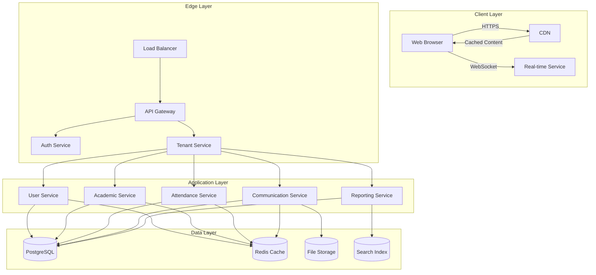
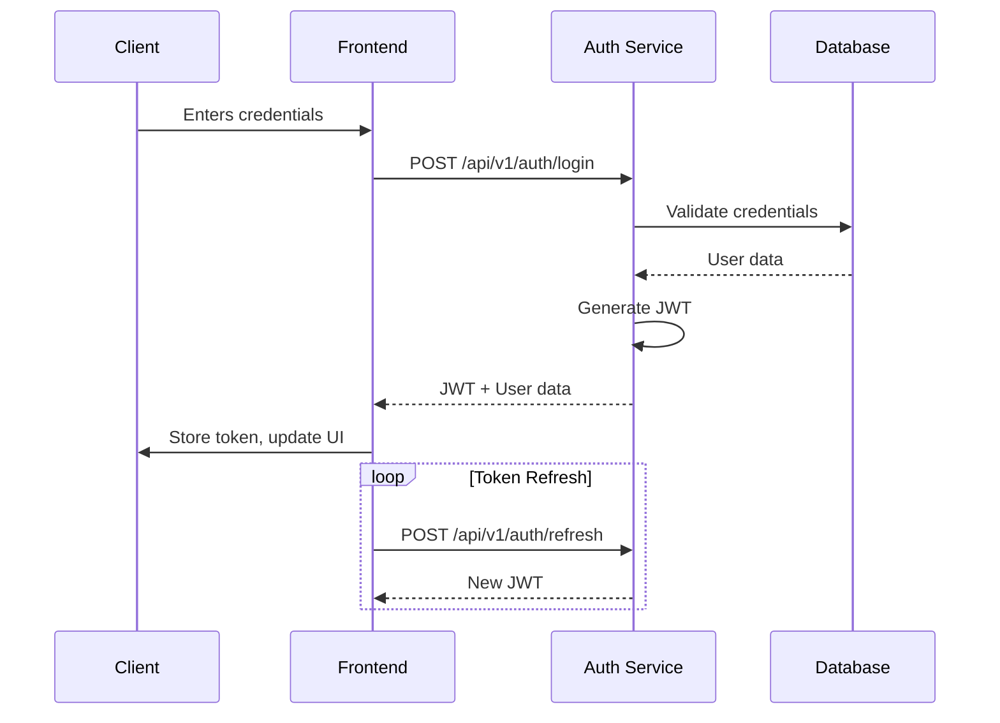
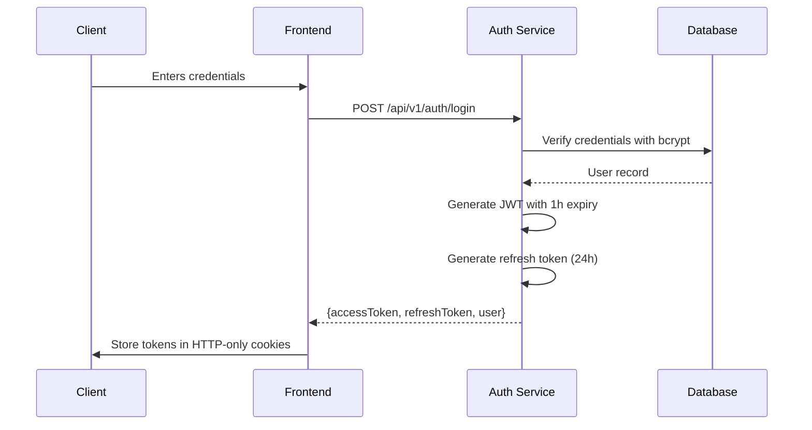

# Scope Platform - Technical Build Plan

## Table of Contents
1. [Project Overview](#project-overview)
2. [System Architecture](#system-architecture)
   - [2.1. High-Level Architecture](#21-high-level-architecture)
   - [2.2. Data Flow](#22-data-flow)
   - [2.3. Technology Stack](#23-technology-stack)
3. [Database Schema](#database-schema)
   - [3.1. Core Tables](#31-core-tables)
   - [3.2. Multi-tenancy Implementation](#32-multi-tenancy-implementation)
4. [API Specifications](#api-specifications)
   - [4.1. Authentication](#41-authentication)
   - [4.2. Core Endpoints](#42-core-endpoints)
   - [4.3. Versioning Strategy](#43-versioning-strategy)
5. [Security Implementation](#security-implementation)
   - [5.1. Authentication Flows](#51-authentication-flows)
   - [5.2. Authorization Model](#52-authorization-model)
   - [5.3. Data Protection](#53-data-protection)
6. [Development Workflow](#development-workflow)
   - [6.1. Local Development](#61-local-development)
   - [6.2. Code Style & Standards](#62-code-style--standards)
   - [6.3. Git Branching Strategy](#63-git-branching-strategy)
7. [Testing Strategy](#testing-strategy)
   - [7.1. Unit Testing](#71-unit-testing)
   - [7.2. Integration Testing](#72-integration-testing)
   - [7.3. E2E Testing](#73-e2e-testing)
   - [7.4. Performance Testing](#74-performance-testing)
8. [Deployment Pipeline](#deployment-pipeline)
   - [8.1. CI/CD Workflow](#81-cicd-workflow)
   - [8.2. Environment Configuration](#82-environment-configuration)
   - [8.3. Rollback Procedures](#83-rollback-procedures)
9. [Monitoring & Observability](#monitoring--observability)
   - [9.1. Logging Strategy](#91-logging-strategy)
   - [9.2. Metrics Collection](#92-metrics-collection)
   - [9.3. Alerting Rules](#93-alerting-rules)
10. [Documentation](#documentation)
    - [10.1. API Documentation](#101-api-documentation)
    - [10.2. Developer Guides](#102-developer-guides)
    - [10.3. Operational Runbooks](#103-operational-runbooks)
11. [Compliance & Security](#compliance--security)
    - [11.1. ISO 27001 Controls](#111-iso-27001-controls)
    - [11.2. Data Protection](#112-data-protection)
    - [11.3. Audit Requirements](#113-audit-requirements)
12. [Scaling & Performance](#scaling--performance)
    - [12.1. Database Scaling](#121-database-scaling)
    - [12.2. Application Scaling](#122-application-scaling)
    - [12.3. Caching Strategy](#123-caching-strategy)
13. [Disaster Recovery](#disaster-recovery)
    - [13.1. Backup Strategy](#131-backup-strategy)
    - [13.2. Recovery Procedures](#132-recovery-procedures)
14. [Timeline & Milestones](#timeline--milestones)
15. [Risks & Mitigations](#risks--mitigations)

## Project Overview

### 1.1 Purpose
Enterprise-grade school management platform replacing traditional MIS systems with modern, cloud-native architecture. The platform will support:

- **Multi-tenant hierarchy** (Trusts > Schools > Departments)
- **Granular, role-based access control** with custom permission sets
- **Module-based licensing** with feature flags
- **Extensible architecture** for future integrations
- **Comprehensive audit trails** for all sensitive operations

### 1.2 Core User Personas

#### 1.2.1 Platform Administrators
- Manage system-wide settings
- Configure tenant hierarchy
- Monitor system health and performance
- Manage global user accounts and permissions

#### 1.2.2 Trust Administrators
- Manage multiple schools within a trust
- Configure trust-wide policies and settings
- Access cross-school reporting
- Manage trust-level user accounts

#### 1.2.3 School Administrators
- Manage school-specific configuration
- Handle staff and student records
- Generate reports
- Configure academic terms and timetables

#### 1.2.4 Teachers
- Record and track student progress
- Manage classroom activities
- Communicate with students and parents
- Access teaching resources

#### 1.2.5 Students
- View timetables and assignments
- Access learning materials
- Submit work
- Track personal progress

#### 1.2.6 Parents/Guardians
- Monitor child's progress
- Receive school communications
- Update contact information
- Schedule parent-teacher meetings

### 1.3 System Boundaries

#### 1.3.1 In Scope
- User authentication and authorization
- Multi-tenant data isolation
- Academic record management
- Attendance tracking
- Communication tools
- Reporting and analytics
- Integration with third-party services

#### 1.3.2 Out of Scope (Initial Release)
- Mobile application development
- Advanced business intelligence
- Custom report builder
- Advanced data visualization

### 1.4 Key Technical Requirements

#### 1.4.1 Performance
- Page load time < 2 seconds (95th percentile)
- Support for 10,000+ concurrent users
- 99.9% uptime SLA

#### 1.4.2 Security
- ISO 27001 and Cyber Essentials compliance
- End-to-end encryption for sensitive data
- Regular security audits and penetration testing

#### 1.4.3 Compliance
- GDPR compliance for EU/UK data protection
- Accessibility compliance (WCAG 2.1 AA)
- Data retention policies

### 1.5 Success Metrics
- User adoption rate (>80% within first 3 months)
- System uptime (99.9%)
- Average response time (<500ms for API calls)
- Number of support tickets per user (target < 0.1 per user per month)

## 2. System Architecture

### 2.1 High-Level Architecture



### 2.2 Component Breakdown

#### 2.2.1 Frontend
- **Framework**: Next.js 15 with App Router
- **State Management**: React Query + Zustand
- **UI Components**: Radix UI + Tailwind CSS
- **Form Handling**: React Hook Form + Zod
- **Internationalization**: next-intl
- **Real-time Updates**: WebSocket + Server-Sent Events

#### 2.2.2 Backend Services
- **API Gateway**: Next.js API Routes
- **Service Communication**: tRPC for type-safe APIs
- **Authentication**: NextAuth.js with JWT
- **Background Jobs**: BullMQ with Redis
- **File Processing**: Sharp for images, pdf-lib for PDFs
- **Search**: Meilisearch for full-text search

#### 2.2.3 Data Layer
- **Primary Database**: PostgreSQL 15+ with TimescaleDB
- **Caching**: Redis 7+
- **Object Storage**: S3-compatible storage
- **Search Index**: Meilisearch
- **Message Queue**: Redis Streams

#### 2.2.4 Infrastructure
- **Containerization**: Docker
- **Orchestration**: Docker Compose (local), Kubernetes (production)
- **Infrastructure as Code**: Terraform
- **Secrets Management**: HashiCorp Vault
- **CI/CD**: GitHub Actions

### 2.3 Data Flow

#### 2.3.1 Authentication Flow


#### 2.3.2 Multi-tenant Request Flow
1. Request arrives at API Gateway with JWT
2. Auth Service validates JWT and extracts tenant context
3. Tenant Service resolves tenant hierarchy and permissions
4. Request is routed to appropriate service with tenant context
5. Service applies tenant isolation at data access layer
6. Response is returned with appropriate CORS and security headers

### 2.4 Cross-Cutting Concerns

#### 2.4.1 Logging
- Structured JSON logging with Pino
- Correlation IDs for request tracing
- Log levels: ERROR, WARN, INFO, DEBUG, TRACE
- Sensitive data redaction

#### 2.4.2 Error Handling
- Standardized error responses
- Error codes and user-friendly messages
- Stack traces in non-production environments
- Error tracking with Sentry

#### 2.4.3 Security
- Rate limiting per IP and user
- CSRF protection
- Security headers (CSP, HSTS, etc.)
- Request validation and sanitization
- SQL injection prevention with parameterized queries

#### 2.4.4 Performance
- Response compression
- Request/response caching
- Database query optimization
- Asset optimization (images, scripts, styles)

## 3. Database Schema

### 3.1 Core Entities

#### 3.1.1 Multi-tenancy

```prisma
model Tenant {
  id          String   @id @default(cuid())
  name        String
  type        TenantType
  parentId    String?
  parent      Tenant?  @relation("TenantHierarchy", fields: [parentId], references: [id])
  children    Tenant[] @relation("TenantHierarchy")
  isActive    Boolean  @default(true)
  settings    Json?    // Tenant-specific configuration
  features    FeatureFlag[]
  users       TenantUser[]
  roles       Role[]
  createdAt   DateTime @default(now())
  updatedAt   DateTime @updatedAt
  createdBy   String
  updatedBy   String
  
  @@index([parentId])
  @@unique([name, parentId])
}

enum TenantType {
  TRUST
  SCHOOL
  DEPARTMENT
}

model FeatureFlag {
  id          String   @id @default(cuid())
  name        String
  description String?
  isEnabled   Boolean  @default(false)
  tenantId    String
  tenant      Tenant   @relation(fields: [tenantId], references: [id])
  settings    Json?    // Feature-specific settings
  createdAt   DateTime @default(now())
  updatedAt   DateTime @updatedAt
  
  @@unique([name, tenantId])
}
```

#### 3.1.2 Authentication & Authorization

```prisma
model User {
  id             String       @id @default(cuid())
  email          String?      @unique
  emailVerified  DateTime?
  name           String?
  image          String?
  hashedPassword String?      @db.Text
  isActive       Boolean      @default(true)
  lastLoginAt    DateTime?
  tenantUsers    TenantUser[]
  sessions       Session[]
  accounts       Account[]
  auditLogs      AuditLog[]
  createdAt      DateTime     @default(now())
  updatedAt      DateTime     @updatedAt
}

model TenantUser {
  id        String   @id @default(cuid())
  userId    String
  user      User     @relation(fields: [userId], references: [id])
  tenantId  String
  tenant    Tenant   @relation(fields: [tenantId], references: [id])
  roleId    String
  role      Role     @relation(fields: [roleId], references: [id])
  isActive  Boolean  @default(true)
  metadata  Json?    // Additional user-tenant specific data
  createdAt DateTime @default(now())
  updatedAt DateTime @updatedAt

  @@unique([userId, tenantId])
  @@index([tenantId])
  @@index([roleId])
}

model Role {
  id           String      @id @default(cuid())
  name         String
  description  String?
  isSystem     Boolean     @default(false)
  permissions  Json        // Array of permission strings
  tenantId     String
  tenant       Tenant     @relation(fields: [tenantId], references: [id])
  tenantUsers  TenantUser[]
  createdAt    DateTime    @default(now())
  updatedAt    DateTime    @updatedAt
  createdBy    String
  updatedBy    String
  
  @@unique([name, tenantId])
}
```

#### 3.1.3 Audit Logging

```prisma
model AuditLog {
  id          String   @id @default(cuid())
  action      String   // CRUD operation
  entityType  String   // Affected entity type
  entityId    String   // Affected entity ID
  userId      String
  user        User     @relation(fields: [userId], references: [id])
  tenantId    String
  tenant      Tenant   @relation(fields: [tenantId], references: [id])
  metadata    Json?    // Additional context
  ipAddress   String?
  userAgent   String?
  timestamp   DateTime @default(now())
  
  @@index([entityType, entityId])
  @@index([userId])
  @@index([tenantId])
  @@index([timestamp])
}
```

### 3.2 Data Access Patterns

#### 3.2.1 Multi-tenant Data Isolation

1. **Row-Level Security (RLS)**:
   - Implement RLS policies in PostgreSQL
   - Each query automatically scoped to user's tenant context
   - Example policy:
     ```sql
     CREATE POLICY tenant_isolation_policy ON table_name
       USING (tenant_id = current_setting('app.current_tenant_id')::uuid);
     ```

2. **Connection Pooling**:
   - Use PgBouncer with transaction pooling
   - Set `app.current_tenant_id` at connection time

3. **Caching Strategy**:
   - Cache keys include tenant ID
   - Namespaced Redis keys: `tenant:{id}:cache_key`
   - Cache invalidation on tenant data changes

### 3.3 Migrations & Seeding

1. **Migrations**:
   - Prisma migrations for schema changes
   - Versioned migration files
   - Rollback capabilities

2. **Seeding**:
   - Initial admin user creation
   - System roles and permissions
   - Default tenant configuration

## 4. API Specifications

### 4.1 Authentication API

#### 4.1.1 Login
```http
POST /api/v1/auth/login
Content-Type: application/json

{
  "email": "user@example.com",
  "password": "securepassword"
}
```

**Response**:
```json
{
  "accessToken": "jwt.token.here",
  "refreshToken": "refresh.token.here",
  "user": {
    "id": "user_123",
    "email": "user@example.com",
    "name": "John Doe",
    "roles": ["admin"],
    "permissions": ["users:read", "users:write"]
  },
  "expiresIn": 3600
}
```

#### 4.1.2 Token Refresh
```http
POST /api/v1/auth/refresh
Authorization: Bearer {refreshToken}
```

### 4.2 Tenant Management API

#### 4.2.1 Create Tenant
```http
POST /api/v1/tenants
Authorization: Bearer {accessToken}
Content-Type: application/json

{
  "name": "Acme School Trust",
  "type": "TRUST",
  "parentId": null,
  "settings": {
    "timezone": "Europe/London",
    "locale": "en-GB"
  }
}
```

### 4.3 User Management API

#### 4.3.1 Create User
```http
POST /api/v1/users
Authorization: Bearer {accessToken}
Content-Type: application/json

{
  "email": "teacher@example.com",
  "name": "Jane Smith",
  "password": "SecurePass123!",
  "roleId": "role_teacher",
  "tenantId": "tenant_123"
}
```

### 4.4 API Versioning

- Version in URL path: `/api/v1/...`
- Content negotiation with `Accept` header
- Deprecation policy: 6 months notice for breaking changes
- Automatic API documentation with Swagger UI at `/api-docs`

## 5. Security Implementation

### 5.1 Authentication & Authorization

#### 5.1.1 Authentication Flows



#### 5.1.2 Password Policy
- Minimum 12 characters
- Require uppercase, lowercase, number, special character
- Password history (last 5 passwords)
- Account lockout after 5 failed attempts (30 min cooldown)
- Password rotation every 90 days
- Banned password list (top 10,000 common passwords)

### 5.2 Data Protection

#### 5.2.1 Encryption
- **At Rest**:
  - AES-256 encryption for sensitive data
  - Database-level encryption (TDE) for PostgreSQL
  - Encrypted backups with customer-managed keys
- **In Transit**:
  - TLS 1.3 for all communications
  - HSTS with 1-year duration
  - Certificate pinning for mobile apps

#### 5.2.2 Data Masking
- PII masking in logs: `{masked: "user@example.com"}`
- Partial SSN display: `***-**-1234`
- Role-based data visibility

### 5.3 Compliance Controls

#### 5.3.1 ISO 27001 Controls
```yaml
access_control:
  user_access_management:
    - Automated user provisioning/deprovisioning
    - Role-based access control (RBAC)
    - Least privilege principle
  
cryptography:
  key_management:
    - Hardware Security Modules (HSMs) for key storage
    - Key rotation every 90 days
    - Key versioning for data recovery

incident_management:
  response_plan:
    - 24/7 on-call rotation
    - 1-hour response time for critical issues
    - Post-incident reviews with root cause analysis
```

#### 5.3.2 Cyber Essentials
- Firewall configuration
- Secure configuration (disable unused services)
- User access control
- Malware protection
- Patch management (critical updates within 14 days)

### 5.4 Security Headers
```typescript
// Next.js configuration
export const securityHeaders = [
  {
    key: 'X-Content-Type-Options',
    value: 'nosniff',
  },
  {
    key: 'X-Frame-Options',
    value: 'DENY',
  },
  {
    key: 'X-XSS-Protection',
    value: '1; mode=block',
  },
  {
    key: 'Content-Security-Policy',
    value: "default-src 'self'; script-src 'self' 'unsafe-inline' 'unsafe-eval'; style-src 'self' 'unsafe-inline'; img-src 'self' data:; font-src 'self'; connect-src 'self' *.example.com;"
  },
  {
    key: 'Strict-Transport-Security',
    value: 'max-age=63072000; includeSubDomains; preload'
  },
  {
    key: 'Referrer-Policy',
    value: 'strict-origin-when-cross-origin'
  }
];
```

### 5.5 Security Testing

#### 5.5.1 Automated Scanning
- OWASP ZAP for dynamic analysis
- Snyk for dependency scanning
- Semgrep for static code analysis
- Trivy for container scanning

#### 5.5.2 Penetration Testing
- Quarterly external penetration tests
- Bug bounty program
- Automated security tests in CI/CD pipeline

## 6. Optional Modules

### 6.1 Parent Portal (Opt-in)
- Student progress tracking
- Attendance monitoring
- Fee payment integration
- Parent-teacher communication
- Event calendar with RSVP

### 6.2 Advanced Communication (Opt-in)
- Video conferencing integration
- Announcement channels
- Emergency alert system
- Two-way messaging platform

### 6.3 Document Management (Opt-in)
- Version control for documents
- E-signature support
- Document templates
- Bulk upload/download functionality
- Secure document sharing

### 6.4 Integration Hub (Opt-in)
- LMS integration (Google Classroom, Moodle)
- SIS/SMS system connectors
- Payment gateway integrations
- Third-party API marketplace

## 7. Future Phases

### 7.1 Mobile Applications
- Native iOS and Android apps
- Push notifications
- Offline functionality
- Mobile-optimized UI/UX
- Biometric authentication

### 7.2 Advanced Analytics
- Custom report builder
- Interactive dashboards
- Predictive analytics
- Data export capabilities
- Custom KPI tracking

## 8. Platform Customization

### 8.1 Branding & Theming
- School/trust branding
- Custom color schemes
- Logo upload
- Custom email templates
- White-labeling options

## 9. Development Workflow

### 6.1 Local Development

#### 6.1.1 Prerequisites
- Docker & Docker Compose
- Node.js 18+
- PostgreSQL 15+
- Redis 7+

#### 6.1.2 Setup
```bash
# Clone repository
git clone https://github.com/your-org/scope-platform.git
cd scope-platform

# Install dependencies
npm install

# Start development environment
docker-compose up -d
npm run dev
```

## Development Phases

### Phase 1: Core Infrastructure (Current Phase)
1. **Multi-tenancy**
   - [ ] Implement trust hierarchy data model
   - [ ] Tenant isolation middleware
   - [ ] Cross-tenant admin views

2. **Authentication & Authorization**
   - [x] Email/password auth (completed)
   - [ ] RBAC implementation
   - [ ] Permission system
   - [ ] Audit logging

3. **DevOps & CI/CD**
   - [ ] Terraform setup for GCP
   - [ ] GitHub Actions workflows
   - [ ] Environment configurations

### Phase 2: Academic Management
1. **Student Information**
   - [ ] Student profiles
   - [ ] Guardian management
   - [ ] Medical records

2. **Timetabling**
   - [ ] Schedule management
   - [ ] Room allocation
   - [ ] Staff assignments

### Phase 3: Communication
1. **Messaging**
   - [ ] Internal messaging
   - [ ] Announcements
   - [ ] Parent portal

2. **Integrations**
   - [ ] Email providers
   - [ ] SMS gateways
   - [ ] Homework systems

### Phase 4: Additional Modules
1. **Library Management**
2. **Event Management**
3. **Catering**
4. **Visitor Management**

## Technical Specifications

### API Design
- RESTful endpoints with OpenAPI 3.0
- Versioned endpoints (/api/v1/...)
- Rate limiting and request validation
- Comprehensive error handling

### Database
- PostgreSQL with Row Level Security (RLS)
- Connection pooling with PgBouncer
- Regular backups with point-in-time recovery

### Security
- Data encryption at rest and in transit
- Regular security audits
- Penetration testing
- ISO 27001 and Cyber Essentials compliance

## Testing Strategy

### Unit Testing
- Jest + React Testing Library
- 80%+ code coverage
- Snapshot testing

### Integration Testing
- API contract testing
- Database transaction tests
- Auth flow tests

### E2E Testing
- Playwright for browser automation
- Critical user journeys
- Performance benchmarking

## Deployment & Operations

### Environments
- Development
- Staging
- Production

### Infrastructure as Code
- Terraform modules for GCP
- Environment parity
- Secret management

## Monitoring & Maintenance

### Logging
- Structured JSON logs
- Centralized log aggregation
- Retention policies

### Alerting
- Error tracking
- Performance monitoring
- Security incidents

## Timeline & Milestones

### Q3 2025: MVP
- Core infrastructure
- Basic academic management
- Essential communications

### Q4 2025: Beta
- Additional modules
- SSO integration
- Advanced reporting

### Q1 2026: GA
- Performance optimization
- Security certification
- Partner integrations

## Risks & Mitigations

| Risk | Impact | Probability | Mitigation |
|------|--------|-------------|-------------|
| Scope creep | High | Medium | Strict feature gating |
| Performance issues | High | Low | Early load testing |
| Security vulnerabilities | Critical | Medium | Regular audits |
| Integration challenges | Medium | High | API contracts |

---
*Last Updated: 2025-06-22*
